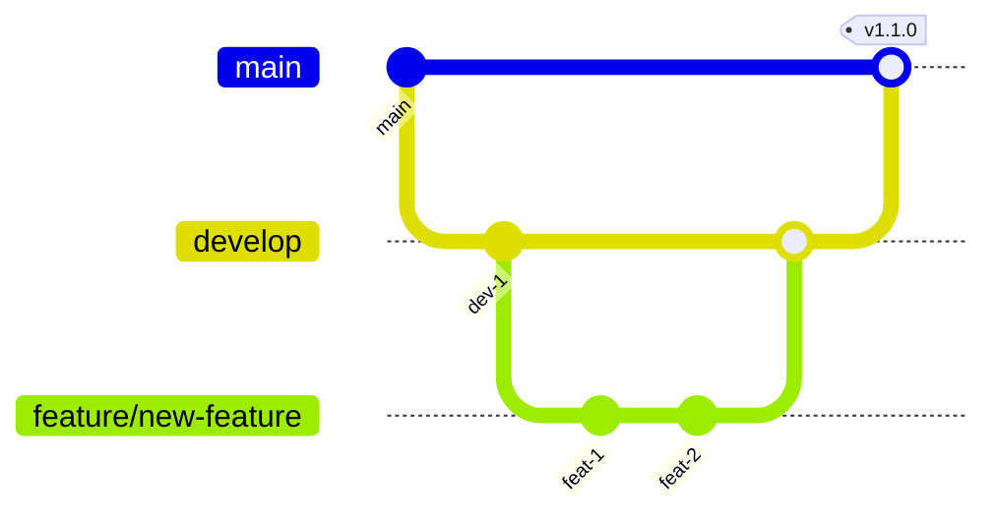
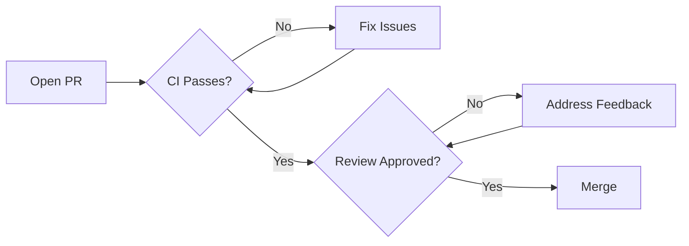

# Contributing to CertPrep.ai

First off, thank you for considering contributing to CertPrep.ai! 🎉

This document provides guidelines and steps for contributing. Following these guidelines helps communicate that you respect the time of the developers managing and developing this open-source project.

---

## 📋 Table of Contents

- [Code of Conduct](#code-of-conduct)
- [Getting Started](#getting-started)
- [How Can I Contribute?](#how-can-i-contribute)
- [Development Process](#development-process)
- [Style Guidelines](#style-guidelines)
- [Commit Messages](#commit-messages)
- [Pull Request Process](#pull-request-process)
- [Community](#community)

---

## 📜 Code of Conduct

This project and everyone participating in it is governed by our [Code of Conduct](CODE_OF_CONDUCT.md). By participating, you are expected to uphold this code. Please report unacceptable behavior to [conduct@certprep.ai](mailto:conduct@certprep.ai).

---

## 🚀 Getting Started

### Prerequisites

Before you begin, ensure you have the following installed:

| Tool | Version | Check Command |
|------|---------|---------------|
| Node.js | ≥18.0.0 | `node --version` |
| npm | ≥9.0.0 | `npm --version` |
| Git | Latest | `git --version` |

### Development Setup

<details>
<summary>Click to expand setup steps</summary>

1. **Fork the repository**

   Click the "Fork" button at the top right of the repository page.

2. **Clone your fork**

   ```bash
   git clone https://github.com/YOUR_USERNAME/CertPrep.ai.git
   cd CertPrep.ai
   ```

3. **Add upstream remote**

   ```bash
   git remote add upstream https://github.com/TJZine/CertPrep.ai.git
   ```

4. **Install dependencies**

   ```bash
   npm install
   ```

5. **Set up environment variables**

   ```bash
   cp .env.example .env.local
   # Edit .env.local with your values
   ```

6. **Start development server**

   ```bash
   npm run dev
   ```

</details>

---

## 🤔 How Can I Contribute?

### 🐛 Reporting Bugs

Before creating bug reports, please check the [existing issues](https://github.com/TJZine/CertPrep.ai/issues) to avoid duplicates.

<details>
<summary>Bug Report Guidelines</summary>

**Great Bug Reports include:**

- [ ] A clear, descriptive title
- [ ] Exact steps to reproduce the issue
- [ ] Expected behavior vs actual behavior
- [ ] Screenshots or GIFs (if applicable)
- [ ] Environment details (OS, browser, Node version)
- [ ] Any relevant error messages or logs

**Use this template:**

```markdown
## Bug Description
A clear and concise description of the bug.

## Steps to Reproduce
1. Go to '...'
2. Click on '...'
3. Scroll down to '...'
4. See error

## Expected Behavior
What you expected to happen.

## Actual Behavior
What actually happened.

## Screenshots
If applicable, add screenshots.

## Environment
- OS: [e.g., macOS 14.0]
- Browser: [e.g., Chrome 120]
- Node.js: [e.g., 18.17.0]
- Version: [e.g., 1.2.0]

## Additional Context
Any other context about the problem.
```

</details>

### 💡 Suggesting Enhancements

Enhancement suggestions are tracked as [GitHub issues](https://github.com/TJZine/CertPrep.ai/issues).

<details>
<summary>Enhancement Suggestion Guidelines</summary>

**Include:**

- [ ] Clear, descriptive title
- [ ] Detailed description of the proposed feature
- [ ] Explanation of why this enhancement would be useful
- [ ] Possible implementation approach (if you have ideas)
- [ ] Mockups or examples (if applicable)

</details>

### 🔧 Pull Requests

We actively welcome your pull requests!

| Type | Branch Prefix | Example |
|------|---------------|---------|
| Feature | `feature/` | `feature/add-dark-mode` |
| Bug Fix | `fix/` | `fix/login-validation` |
| Documentation | `docs/` | `docs/update-readme` |
| Refactor | `refactor/` | `refactor/auth-flow` |
| Performance | `perf/` | `perf/optimize-queries` |
| Test | `test/` | `test/add-unit-tests` |

---

## 💻 Development Process

### Branch Strategy



### Workflow

1. **Sync with upstream**
   ```bash
   git fetch upstream
   git checkout main
   git merge upstream/main
   ```

2. **Create a branch**
   ```bash
   git checkout -b feature/your-feature-name
   ```

3. **Make your changes**
   - Write code
   - Add tests
   - Update documentation

4. **Run checks locally**
   ```bash
   npm run lint        # Check linting
   npm run typecheck   # Check types
   npm run test        # Run tests
   npm run build       # Verify build
   ```

5. **Commit your changes**
   ```bash
   git add .
   git commit -m "feat: add amazing feature"
   ```

6. **Push and create PR**
   ```bash
   git push origin feature/your-feature-name
   ```

---

## 📝 Style Guidelines

### TypeScript

We follow strict TypeScript practices:

```typescript
// ✅ Good
interface UserProps {
  id: string
  name: string
  email: string
}

function getUser(id: string): Promise<UserProps> {
  // implementation
}

// ❌ Avoid
function getUser(id: any): any {
  // implementation
}
```

### React Components

```typescript
// ✅ Good - Typed props, descriptive names
interface ButtonProps {
  variant: 'primary' | 'secondary'
  children: React.ReactNode
  onClick?: () => void
  disabled?: boolean
}

export function Button({ variant, children, onClick, disabled }: ButtonProps) {
  return (
    <button
      className={cn('btn', `btn-${variant}`)}
      onClick={onClick}
      disabled={disabled}
    >
      {children}
    </button>
  )
}

// ❌ Avoid - Untyped, unclear
export function Button(props) {
  return <button {...props} />
}
```

### File Naming

| Type | Convention | Example |
|------|------------|---------|
| Components | PascalCase | `UserProfile.tsx` |
| Hooks | camelCase with `use` prefix | `useAuth.ts` |
| Utilities | camelCase | `formatDate.ts` |
| Types | PascalCase | `User.ts` |
| Constants | SCREAMING_SNAKE_CASE | `API_ENDPOINTS.ts` |

### CSS/Tailwind

```tsx
// ✅ Good - Organized, readable
<div className={cn(
  // Layout
  'flex items-center justify-between',
  // Spacing
  'p-4 gap-2',
  // Colors
  'bg-white dark:bg-gray-900',
  // Borders
  'border rounded-lg',
  // Responsive
  'md:p-6 lg:gap-4'
)}>

// ❌ Avoid - Long, unorganized
<div className="flex items-center justify-between p-4 gap-2 bg-white dark:bg-gray-900 border rounded-lg md:p-6 lg:gap-4">
```

---

## 📨 Commit Messages

We follow [Conventional Commits](https://www.conventionalcommits.org/):

```text
<type>(<scope>): <description>

[optional body]

[optional footer(s)]
```

### Types

| Type | Description | Example |
|------|-------------|---------|
| `feat` | New feature | `feat(auth): add password reset` |
| `fix` | Bug fix | `fix(quiz): correct score calculation` |
| `docs` | Documentation | `docs: update API reference` |
| `style` | Code style (formatting) | `style: fix indentation` |
| `refactor` | Code refactoring | `refactor(sync): simplify logic` |
| `perf` | Performance improvement | `perf: optimize query` |
| `test` | Adding tests | `test: add auth unit tests` |
| `chore` | Maintenance | `chore: update dependencies` |
| `ci` | CI/CD changes | `ci: add coverage report` |

### Examples

```bash
# ✅ Good commits
feat(quiz): add timer pause functionality
fix(auth): resolve session expiry redirect loop
docs(readme): add deployment instructions
refactor(sync): extract validation logic
test(results): add integration tests for sync

# ❌ Bad commits
fixed stuff
updates
WIP
asdfgh
```

### Commit Message Body

For complex changes, include a body:

```text
feat(sync): implement conflict resolution

- Add last-write-wins strategy for conflicts
- Store conflict metadata for debugging
- Add user notification for resolved conflicts

Closes #123
```

---

## 🔄 Pull Request Process

### Before Submitting

- [ ] Code follows project style guidelines
- [ ] Self-reviewed my own code
- [ ] Commented hard-to-understand areas
- [ ] Made corresponding documentation changes
- [ ] Changes generate no new warnings
- [ ] Added tests that prove fix/feature works
- [ ] New and existing tests pass locally
- [ ] Any dependent changes have been merged

### PR Title Format

Follow the same convention as commits:

```text
feat(scope): description
fix(scope): description
docs: description
```

### PR Description Template

```markdown
## Description
Brief description of changes.

## Type of Change
- [ ] 🐛 Bug fix (non-breaking change fixing an issue)
- [ ] ✨ New feature (non-breaking change adding functionality)
- [ ] 💥 Breaking change (fix or feature causing existing functionality to change)
- [ ] 📝 Documentation update

## How Has This Been Tested?
Describe tests you ran and how to reproduce.

## Screenshots (if applicable)
Add screenshots for UI changes.

## Checklist
- [ ] My code follows the project's style guidelines
- [ ] I have performed a self-review
- [ ] I have commented my code where necessary
- [ ] I have updated the documentation
- [ ] My changes generate no new warnings
- [ ] I have added tests
- [ ] All tests pass locally

## Related Issues
Fixes #(issue number)
```

### Review Process

1. **Automated Checks** - CI must pass
2. **Code Review** - At least 1 approval required
3. **Merge** - Squash and merge preferred



---

## 🏷️ Issue Labels

| Label | Description | Color |
|-------|-------------|-------|
| `bug` | Something isn't working | 🔴 Red |
| `enhancement` | New feature request | 🔵 Blue |
| `documentation` | Documentation improvements | 📝 Purple |
| `good first issue` | Good for newcomers | 🟢 Green |
| `help wanted` | Extra attention needed | 🟡 Yellow |
| `priority: high` | High priority | 🟠 Orange |
| `priority: low` | Low priority | ⚪ Gray |
| `wontfix` | Will not be worked on | ⚫ Black |

---

## 🎉 Recognition

Contributors are recognized in:

- [README.md Contributors section](#contributors)
- [CHANGELOG.md](CHANGELOG.md) for each release
- GitHub's contributor graph

---

## ❓ Questions?

- 💬 [GitHub Discussions](https://github.com/TJZine/CertPrep.ai/discussions)
- 📧 Email: [maintainer@certprep.ai](mailto:maintainer@certprep.ai)
- 🐦 Twitter: [@certprepai](https://twitter.com/certprepai)

---

<div align="center">

**Thank you for contributing! 🙌**

</div>