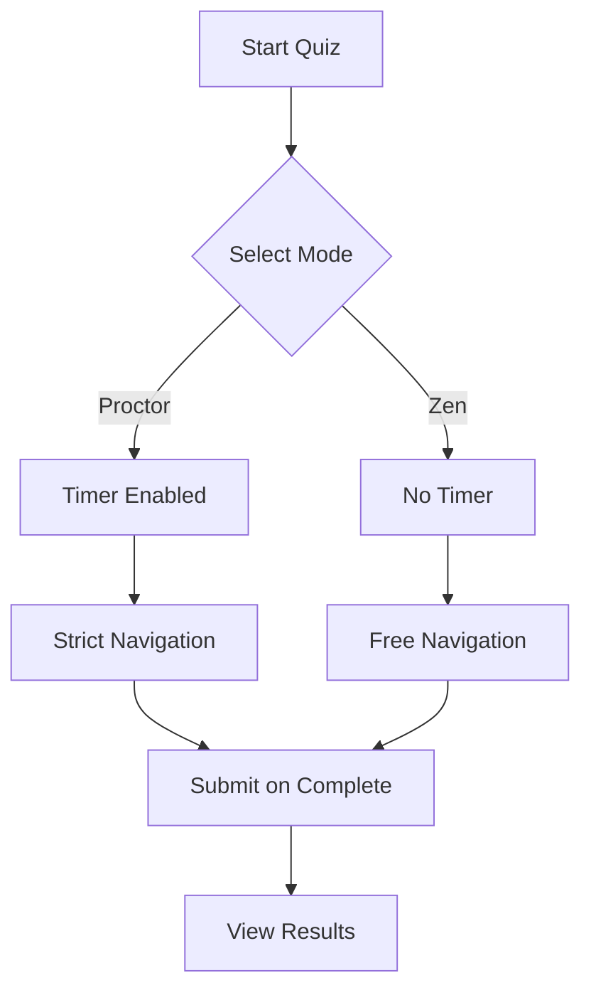
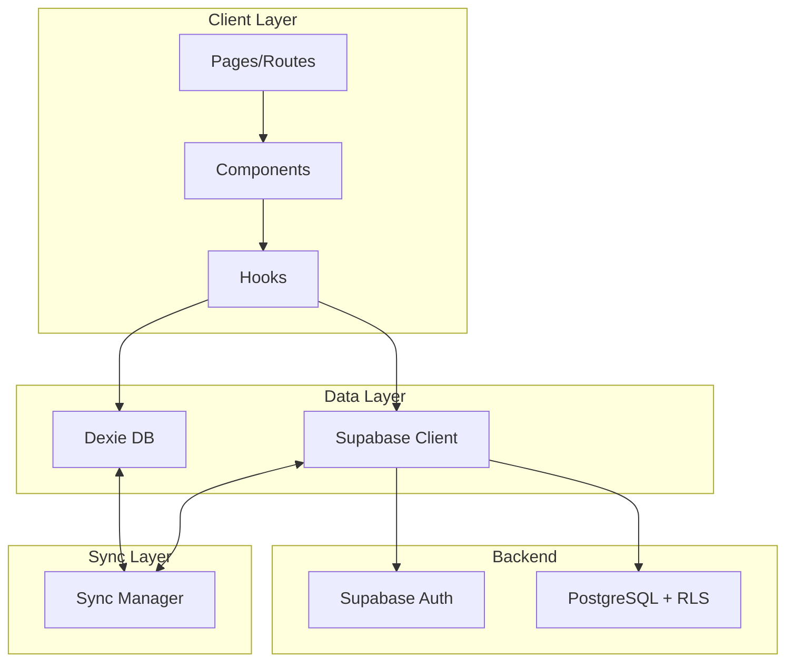

<!-- 
README.md - CertPrep.ai
-->

<!-- Header Section with Logo -->
  
</div>

# CertPrep.ai

**A comprehensive certification preparation platform with offline-first capabilities.**

CertPrep.ai is a modern, offline-first quiz application designed to help users prepare for certifications. It features secure authentication, multiple quiz modes (Zen and Proctor), and detailed analytics to track your progress.

<div align="center">

  <!-- Primary Badges Row -->
  [](LICENSE)
  [](package.json)
  [](https://github.com/TJZine/CertPrep.ai/actions)
  [](https://codecov.io/gh/TJZine/CertPrep.ai)
  
  <!-- Secondary Badges Row -->
  [](https://www.typescriptlang.org/)
  [](https://nextjs.org/)
  [](https://supabase.com/)
  [](https://tailwindcss.com/)

  <!-- Links Row -->
  [Documentation](#documentation) •
  [Getting Started](#getting-started) •
  [Contributing](CONTRIBUTING.md) •
  [Changelog](CHANGELOG.md)

</div>

---

## Features

<!-- Use a feature grid for visual scanning -->
<table>
  <tr>
    <td align="center" width="33%">
      <br>
      <strong>Secure Authentication</strong><br>
      <sub>Email/password auth with Supabase, session management, and secure cookies</sub>
    </td>
    <td align="center" width="33%">
      <br>
      <strong>Offline-First Sync</strong><br>
      <sub>Local IndexedDB storage with automatic cloud synchronization</sub>
    </td>
    <td align="center" width="33%">
      <br>
      <strong>Quiz Modes</strong><br>
      <sub>Proctor and Zen modes for different learning experiences</sub>
    </td>
  </tr>
  <tr>
    <td align="center" width="33%">
      <br>
      <strong>Analytics Dashboard</strong><br>
      <sub>Track progress, scores, and performance over time</sub>
    </td>
    <td align="center" width="33%">
      <br>
      <strong>Responsive Design</strong><br>
      <sub>Fully responsive UI that works on all devices</sub>
    </td>
    <td align="center" width="33%">
      <br>
      <strong>Accessible</strong><br>
      <sub>WCAG 2.1 compliant with full keyboard navigation</sub>
    </td>
  </tr>
</table>

---

## 📋 Table of Contents

<!-- Use for longer READMEs -->
<details>
<summary>Click to expand</summary>

- [Features](#features)
- [Demo](#demo)
- [Getting Started](#🚀-Getting-Started)
  - [Prerequisites](#prerequisites)
  - [Installation](#installation)
  - [Environment Setup](#environment-setup)
- [Security](#-security)
- [License](#-license)
- [Acknowledgments](#-acknowledgments)

</details>

---
## Documentation

## Demo

> **Live Demo:** [https://certprep-ai.vercel.app](https://certprep-ai.vercel.app)

## Getting Startedentials:**
> *Please sign up for a new account to test the application.*

---

## 🚀 Getting Started

### Prerequisites

| Requirement | Version | Installation |
|-------------|---------|--------------|
| Node.js | `>=18.0.0` | [Download](https://nodejs.org/) |
| npm/yarn/pnpm | Latest | Comes with Node.js |
| Supabase Account | - | [Sign up](https://supabase.com/) |

### Installation

```bash
# Clone the repository
git clone https://github.com/TJZine/CertPrep.ai.git

# Navigate to directory
cd CertPrep.ai

# Install dependencies
npm install
# or
yarn install
# or
pnpm install
```

### Environment Setup

1. **Copy the environment template:**

```bash
cp .env.example .env.local
```

2. **Configure required variables:**

```env
# Supabase Configuration (Required)
NEXT_PUBLIC_SUPABASE_URL=your_supabase_project_url
NEXT_PUBLIC_SUPABASE_ANON_KEY=your_supabase_anon_key

# Optional: Analytics
NEXT_PUBLIC_ANALYTICS_ID=your_analytics_id
```

<details>
<summary>📖 Where to find these values</summary>

| Variable | Location |
|----------|----------|
| `SUPABASE_URL` | Supabase Dashboard → Settings → API → Project URL |
| `SUPABASE_ANON_KEY` | Supabase Dashboard → Settings → API → `anon` `public` key |

</details>

3. **Set up the database:**

```bash
# Run Supabase migrations (if applicable)
npx supabase db push

# Or apply SQL manually from supabase/migrations/
```

4. **Start the development server:**

```bash
npm run dev
```

> [!TIP]
> The app will be available at [http://localhost:3000](http://localhost:3000)

---

## 📖 Usage

### Quick Start

```typescript
// Example usage of key features
import { createQuiz, submitResult } from '@/lib/quiz'

// Create a new quiz session
const quiz = await createQuiz({
  mode: 'zen',
  questionCount: 10
})

// Submit results
await submitResult({
  quizId: quiz.id,
  score: 85,
  duration: 300
})
```

### Quiz Modes

| Mode | Description | Best For |
|------|-------------|----------|
| 🎯 **Proctor** | Timed, monitored quiz environment | Assessments, exams |
| 🧘 **Zen** | Relaxed, self-paced learning | Practice, study |

<details>
<summary>View mode comparison</summary>



</details>

---

## Architecture

### Tech Stack

```text
┌─────────────────────────────────────────────────────────────┐
│                        Frontend                              │
├─────────────────────────────────────────────────────────────┤
│  Next.js 16 (App Router) │ React 19 │ TypeScript │ Tailwind │
└─────────────────────────────────────────────────────────────┘
                              │
                              ▼
┌─────────────────────────────────────────────────────────────┐
│                      State & Storage                         │
├─────────────────────────────────────────────────────────────┤
│          Dexie.js (IndexedDB)  │  React Context             │
└─────────────────────────────────────────────────────────────┘
                              │
                              ▼
┌─────────────────────────────────────────────────────────────┐
│                        Backend                               │
├─────────────────────────────────────────────────────────────┤
│     Supabase (Auth + PostgreSQL + RLS + Realtime)           │
└─────────────────────────────────────────────────────────────┘
```

### Project Structure

```text
src/
├── app/                    # Next.js App Router pages
│   ├── (auth)/            # Auth group routes
│   ├── dashboard/         # Dashboard pages
│   └── quiz/              # Quiz pages
├── components/            # React components
│   ├── auth/              # Authentication forms
│   ├── quiz/              # Quiz components
│   ├── results/           # Results display
│   └── ui/                # Shared UI components
├── db/                    # Dexie IndexedDB setup
│   ├── index.ts           # Database initialization
│   ├── quizzes.ts         # Quiz operations
│   └── results.ts         # Results operations
├── hooks/                 # Custom React hooks
├── lib/                   # Utility libraries
│   ├── supabase/          # Supabase clients
│   ├── sync/              # Sync engine
│   └── sanitize.ts        # HTML sanitization
└── types/                 # TypeScript definitions
```

<details>
<summary>View detailed module diagram</summary>



</details>

---

## 📚 Documentation

| Document | Description |
|----------|-------------|
| [📖 API Reference](./docs/API.md) | Complete API documentation |
| [🏗️ Architecture](./docs/ARCHITECTURE.md) | System design and patterns |
| [🔒 Security](./SECURITY.md) | Security policies and practices |
| [🤝 Contributing](./CONTRIBUTING.md) | Contribution guidelines |
| [📝 Changelog](./CHANGELOG.md) | Version history |
| [❓ FAQ](./docs/FAQ.md) | Frequently asked questions |
| [👩‍💻 Code Review](./docs/CODE_REVIEW_IMPLEMENTATION.md) | Implementation standards & persona |

---

## Testing

```bash
# Run all tests
npm test

# Run with coverage
npm run test:coverage

# Run in watch mode
npm run test:watch

# Run E2E tests
npm run test:e2e
```

### Test Coverage

| Category | Coverage |
|----------|----------|
| Statements |  |
| Branches |  |
| Functions |  |
| Lines |  |

---

## Deployment

### Vercel (Recommended)

[](https://vercel.com/new/clone?repository-url=https://github.com/TJZine/CertPrep.ai)

### Manual Deployment

```bash
# Build for production
npm run build

# Start production server
npm start
```

### Environment Variables for Production

> [!IMPORTANT]
> Ensure all required environment variables are set in your production environment.

| Variable | Required | Description |
|----------|----------|-------------|
| `NEXT_PUBLIC_SUPABASE_URL` | ✅ | Supabase project URL |
| `NEXT_PUBLIC_SUPABASE_ANON_KEY` | ✅ | Supabase anonymous key |
| `NEXT_PUBLIC_SITE_URL` | ✅ | Production site URL |

---

## 🤝 Contributing

We welcome contributions! Please see our [Contributing Guide](CONTRIBUTING.md) for details.

### Quick Contribution Steps

1. Fork the repository
2. Create a feature branch (`git checkout -b feature/amazing-feature`)
3. Commit your changes (`git commit -m 'Add new feature'`)
4. Push to the branch (`git push origin feature/amazing-feature`)
5. Open a Pull Request

### Development Commands

| Command | Description |
|---------|-------------|
| `npm run dev` | Start development server |
| `npm run build` | Build for production |
| `npm run lint` | Run ESLint |
| `npm run format` | Format with Prettier |
| `npm run typecheck` | Run TypeScript checks |

---

## Security

> [!CAUTION]
> If you discover a security vulnerability, please report it responsibly.

**Do NOT open a public issue.** Instead, email [security@certprep.ai](mailto:security@certprep.ai).

See [SECURITY.md](SECURITY.md) for our full security policy.

---

## License

This project is licensed under the **Apache 2.0 License** - see the [LICENSE](LICENSE) file for details.

```text
Apache 2.0 License

Copyright (c) 2025 TJZine

Permission is hereby granted, free of charge, to any person obtaining a copy...
```

---

## Acknowledgments

- [Next.js](https://nextjs.org/) - The React Framework
- [Supabase](https://supabase.com/) - Open-source Firebase Alternative
- [Tailwind CSS](https://tailwindcss.com/) - Utility-First CSS Framework
- [Dexie.js](https://dexie.org/) - IndexedDB Wrapper
- [Vercel](https://vercel.com/) - Deployment Platform

