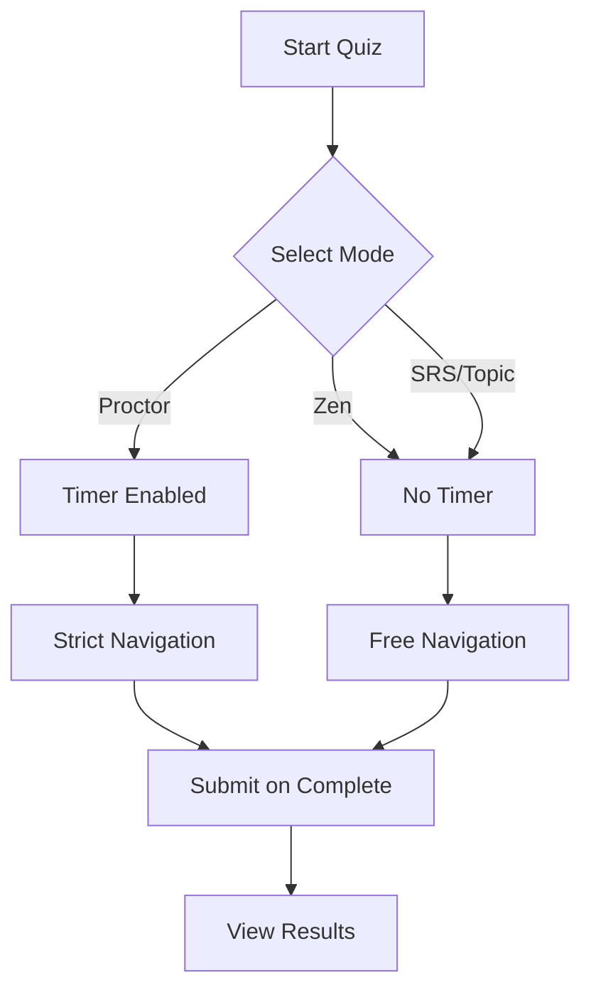

<!--
README.md - CertPrep.ai
-->

<!-- Header Section with Logo -->
<div align="center">
  
</div>

# CertPrep.ai

**A comprehensive certification preparation platform with offline-first capabilities.**

CertPrep.ai is a modern, offline-first quiz application designed to help users prepare for certifications. It features secure authentication, multiple quiz modes (Zen and Proctor), and detailed analytics to track your progress.

<div align="center">

  <!-- Primary Badges Row -->

[](LICENSE)
[](package.json)
[](https://github.com/TJZine/CertPrep.ai/actions)
[](https://codecov.io/gh/TJZine/CertPrep.ai)

  <!-- Secondary Badges Row -->

[](https://www.typescriptlang.org/)
[](https://nextjs.org/)
[](https://supabase.com/)
[](https://tailwindcss.com/)

  </div>

---

<a id="features"></a>

## Features

<!-- Use a feature grid for visual scanning -->
<table>
  <tr>
    <td align="center" width="33%">
      <br>
      <strong>Secure Authentication</strong><br>
      <sub>Email/password auth with Supabase, session management, and secure cookies</sub>
    </td>
    <td align="center" width="33%">
      <br>
      <strong>Offline-First Sync</strong><br>
      <sub>Local IndexedDB storage with automatic cloud synchronization</sub>
    </td>
    <td align="center" width="33%">
      <br>
      <strong>Quiz Modes</strong><br>
      <sub>Proctor, Zen, Topic Study, and Spaced Repetition modes</sub>
    </td>
  </tr>
  <tr>
    <td align="center" width="33%">
      <br>
      <strong>Analytics Dashboard</strong><br>
      <sub>Track progress, heatmaps, and trend charts</sub>
    </td>
    <td align="center" width="33%">
      <br>
      <strong>Responsive Design</strong><br>
      <sub>Fully responsive UI that works on all devices</sub>
    </td>
    <td align="center" width="33%">
      <br>
      <strong>Accessible</strong><br>
      <sub>WCAG 2.1 compliant with full keyboard navigation</sub>
    </td>
  </tr>
</table>

---

## 📋 Table of Contents

<!-- Use for longer READMEs -->
<details>
<summary>Click to expand</summary>

- [Features](#features)
- [Demo](#demo)
- [Getting Started](#getting-started)
  - [Prerequisites](#prerequisites)
  - [Installation](#installation)
  - [Environment Setup](#environment-setup)
- [Usage](#usage)
- [Architecture](#architecture)
- [Documentation](#documentation)
- [Testing](#testing)
- [Deployment](#deployment)
- [Contributing](#contributing)
- [Security](#security)
- [License](#license)
- [Acknowledgments](#acknowledgments)

</details>

---

<a id="demo"></a>

## Demo

> **Live Demo:** [https://cert-prep-ai.vercel.app](https://cert-prep-ai.vercel.app)

## Access

> _Please sign up for a new account to use the application._

---

<a id="getting-started"></a>

## Getting Started

<a id="prerequisites"></a>

### Prerequisites

| Requirement      | Version    | Installation                     |
| ---------------- | ---------- | -------------------------------- |
| Node.js          | `>=24.0.0` | [Download](https://nodejs.org/)  |
| npm/yarn/pnpm    | Latest     | Comes with Node.js               |
| Supabase Account | -          | [Sign up](https://supabase.com/) |

<a id="installation"></a>

### Installation

```bash
# Clone the repository
git clone https://github.com/TJZine/CertPrep.ai.git

# Navigate to directory
cd CertPrep.ai

# Install dependencies
npm install
# or
yarn install
# or
pnpm install
```

<a id="environment-setup"></a>

### Environment Setup

1. **Copy the environment template:**

```bash
cp .env.example .env.local
```

2. **Configure variables by feature area:**

```env
# Core app (required)
NEXT_PUBLIC_SUPABASE_URL=your_supabase_project_url
NEXT_PUBLIC_SUPABASE_ANON_KEY=your_supabase_anon_key
NEXT_PUBLIC_SITE_URL=http://localhost:3000

# Required for signup / password reset flows that use hCaptcha
NEXT_PUBLIC_HCAPTCHA_SITE_KEY=your_hcaptcha_site_key

# Required for admin/service-role flows such as account deletion and Playwright E2E global setup
SUPABASE_SERVICE_ROLE_KEY=your_service_role_key
```

<details>
<summary>📖 Where to find these values</summary>

| Variable                        | Location                                                          |
| ------------------------------- | ----------------------------------------------------------------- |
| `NEXT_PUBLIC_SUPABASE_URL`      | Supabase Dashboard → Settings → API → Project URL                 |
| `NEXT_PUBLIC_SUPABASE_ANON_KEY` | Supabase Dashboard → Settings → API → `anon` `public` key         |
| `NEXT_PUBLIC_HCAPTCHA_SITE_KEY` | hCaptcha Dashboard → Site Key                                     |
| `SUPABASE_SERVICE_ROLE_KEY`     | Supabase Dashboard → Settings → API → `service_role` `secret` key |

</details>

These are local setup hints only. Runtime code, `.env.example`, and the current authority docs win if this section drifts. Some feature areas are optional in local development, but signup/password-reset, self-serve account deletion, and Playwright E2E global setup do require the extra keys above.

3. **Set up the database:**

This repo does **not** currently expose one clean database bootstrap surface.

- Baseline schema/RLS definitions still live in `src/lib/supabase/schema.sql`.
- Repo-root incremental changes live in `supabase/migrations/*`.
- Legacy companion migrations under `src/lib/supabase/migrations/*` are reference-only unless a maintainer explicitly says otherwise.
- Read [docs/ARCHITECTURE.md](./docs/ARCHITECTURE.md) before provisioning or changing the DB path, and do not assume `supabase/migrations/*` alone reconstructs the current database.

4. **Start the development server:**

```bash
npm run dev
```

> [!TIP]
> The app will be available at [http://localhost:3000](http://localhost:3000)

---

<a id="usage"></a>

## 📖 Usage

### Quick Start

1. Start the development server with `npm run dev`.
2. Open [http://localhost:3000](http://localhost:3000) in your browser.
3. Sign up for a new account (or log in).
4. Import a sample quiz from `docs/SAMPLE_QUIZ.json` via the Library/Import UI.
5. Start a quiz (Zen or Proctor mode), complete it, and view your results and analytics.

For code-level examples (auth, quizzes, results, and sync), use implementation files first (`src/db/*`, `src/lib/sync/*`, `src/lib/supabase/*`). [docs/API.md](./docs/API.md) is reference-only and may lag code.

### Quiz Modes

| Mode               | Description                        | Best For            |
| ------------------ | ---------------------------------- | ------------------- |
| 🎯 **Proctor**     | Timed, monitored quiz environment  | Assessments, exams  |
| 🧘 **Zen**         | Relaxed, self-paced learning       | Practice, study     |
| 🧠 **SRS**         | Spaced repetition review (Leitner) | Long-term retention |
| 📚 **Topic**       | Targeted category practice         | Weak area improv.   |
| 🔀 **Interleaved** | Mixed questions from all quizzes   | Varied practice     |

<details>
<summary>View mode comparison</summary>


```mermaid
graph TD
    A[Start Quiz] --> B{Select Mode}
    B -->|Proctor| C[Timer Enabled]
    B -->|Zen| D[No Timer]
    B -->|SRS/Topic| D
    C --> E[Strict Navigation]
    D --> F[Free Navigation]
    E --> G[Submit on Complete]
    F --> G
    G --> H[View Results]
```

</details>

---

<a id="architecture"></a>

## Architecture

This README is not the architecture authority.

For current technical truth, use:

- [docs/ARCHITECTURE.md](./docs/ARCHITECTURE.md) for runtime composition, boundaries, storage, schema truth, hotspots, and working rules
- [AGENTS.md](./AGENTS.md) for control-plane entrypoint defaults
- [docs/ENGINEERING_RUNBOOK.md](./docs/ENGINEERING_RUNBOOK.md) for workflow and verification policy

At a high level, the app uses Next.js App Router for UI/runtime composition, Dexie/IndexedDB for local-first persistence, and Supabase for auth plus remote synchronization.

---

<a id="documentation"></a>

## 📚 Documentation

| Document                                                | Description                                           |
| ------------------------------------------------------- | ----------------------------------------------------- |
| [🤖 Agent Entrypoint](./AGENTS.md)                      | Canonical agent defaults and control-plane entrypoint |
| [🧭 Engineering Runbook](./docs/ENGINEERING_RUNBOOK.md) | Canonical workflow and verification policy            |
| [🏗️ Architecture](./docs/ARCHITECTURE.md)               | Current-state architecture truth surface              |
| [🤝 Contributing](./CONTRIBUTING.md)                    | Contributor workflow and PR expectations              |
| [❓ FAQ](./docs/FAQ.md)                                 | Product/usage FAQ (not setup authority)               |
| [📖 API Reference](./docs/API.md)                       | Reference-only examples that may lag implementation   |
| [🧠 Review Context](./CODE_REVIEW_CONTEXT.md)           | Reference-only review heuristics that may be stale    |
| [🔒 Security](./SECURITY.md)                            | Security policies and practices                       |
| [📝 Changelog](./CHANGELOG.md)                          | Version history                                       |

---

<a id="testing"></a>

## Testing

For required verification sets and caveats, use [docs/ENGINEERING_RUNBOOK.md](./docs/ENGINEERING_RUNBOOK.md). Common local commands still exposed by `package.json` include `npm run verify`, `npm run security-check`, and `npm run build`.

---

<a id="deployment"></a>

## Deployment

Only verified repo-visible facts are documented here. For authority on deployment and release policy, use [docs/ENGINEERING_RUNBOOK.md](./docs/ENGINEERING_RUNBOOK.md).

Verified repo-visible deployment facts:

- CI runs lint/typecheck, tests, and build via [`.github/workflows/ci.yml`](./.github/workflows/ci.yml)
- `main` is synchronized to `staging` via [`.github/workflows/sync-staging.yml`](./.github/workflows/sync-staging.yml)
- The repo exposes production commands for build and start:

```bash
# Build for production
npm run build

# Start production server
npm start
```

Hosting-specific deployment guidance and production environment-variable requirements are intentionally left out here unless backed by current repo evidence.

---

<a id="contributing"></a>

## 🤝 Contributing

We welcome contributions! Please see our [Contributing Guide](CONTRIBUTING.md) for details.

### Quick Contribution Steps

1. Fork the repository
2. Create a feature branch (`git checkout -b feature/amazing-feature`)
3. Commit your changes (`git commit -m 'Add new feature'`)
4. Push to the branch (`git push origin feature/amazing-feature`)
5. Open a Pull Request

### Development Commands

These commands are reference-only onboarding shortcuts. The runbook, not this table, defines which checks are required for a given change.

| Command                  | Description                                      |
| ------------------------ | ------------------------------------------------ |
| `npm run dev`            | Start development server                         |
| `npm run build`          | Build for production                             |
| `npm run verify`         | Canonical local check (lint + typecheck + tests) |
| `npm run lint`           | Run ESLint                                       |
| `npm test`               | Run the test suite                               |
| `npm run security-check` | Run basic secret scanning                        |
| `npm run supabase:types` | Generate DB types                                |

---

<a id="security"></a>

## Security

> [!CAUTION]
> If you discover a security vulnerability, please report it responsibly.

**Do NOT open a public issue.** Please refer to [SECURITY.md](SECURITY.md) for reporting instructions.

See [SECURITY.md](SECURITY.md) for our full security policy.

---

<a id="license"></a>

## License

This project is licensed under the **Apache 2.0 License** - see the [LICENSE](LICENSE) file for details.

```text
Copyright 2025 TJZine
Licensed under the Apache License, Version 2.0 (the "License");
you may not use this file except in compliance with the License.
You may obtain a copy of the License at
    http://www.apache.org/licenses/LICENSE-2.0
```

---

<a id="acknowledgments"></a>

## Acknowledgments

- [Next.js](https://nextjs.org/) - The React Framework
- [Supabase](https://supabase.com/) - Open-source Firebase Alternative
- [Tailwind CSS](https://tailwindcss.com/) - Utility-First CSS Framework
- [Dexie.js](https://dexie.org/) - IndexedDB Wrapper
- [Vercel](https://vercel.com/) - Deployment Platform
