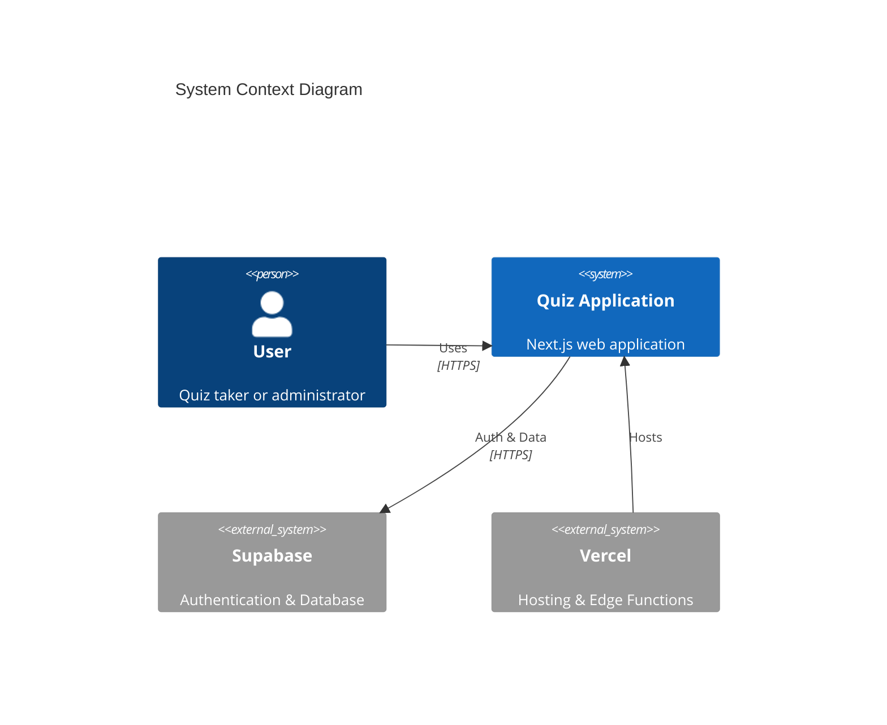
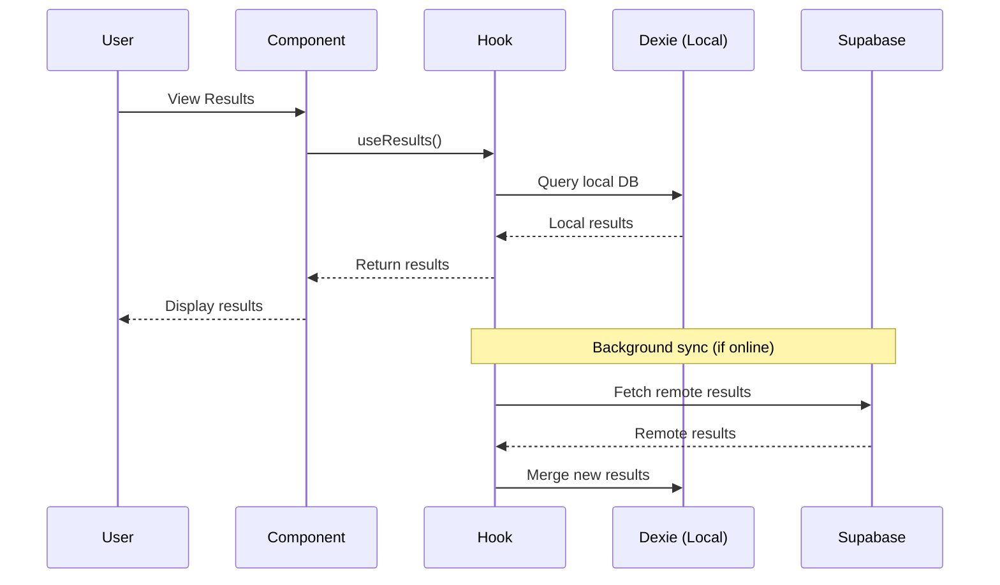
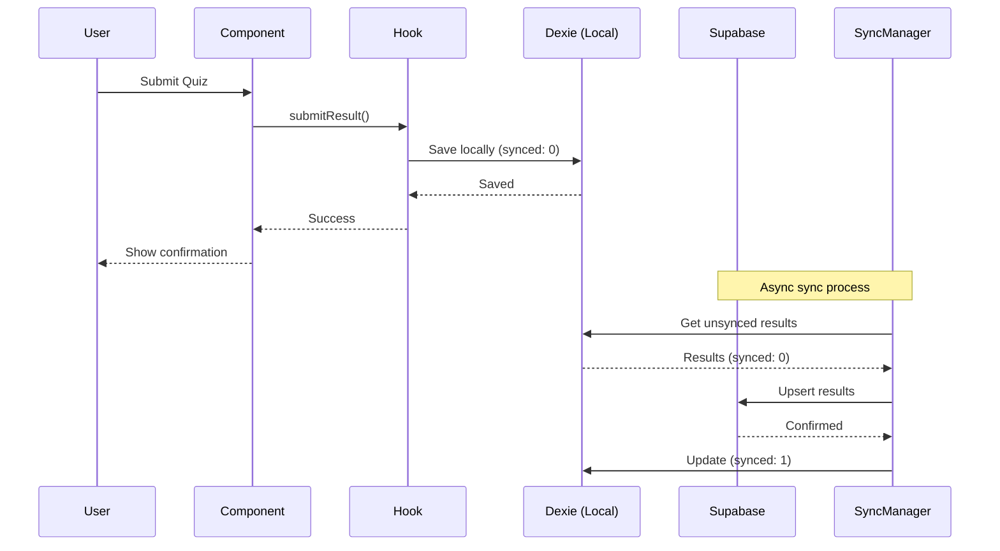
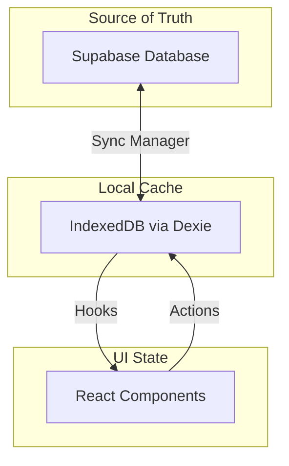
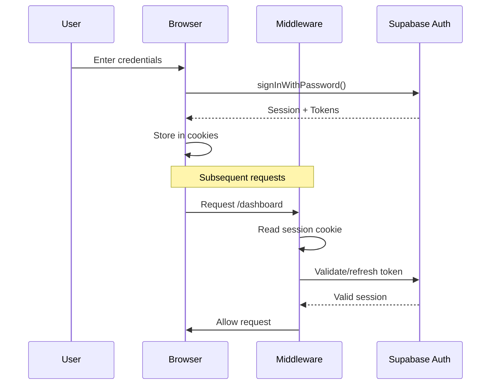

# Architecture Documentation

> This document describes the technical architecture of CertPrep.ai.

## Table of Contents

- [System Overview](#system-overview)
- [Technology Stack](#technology-stack)
- [Application Structure](#application-structure)
- [Data Flow](#data-flow)
- [State Management](#state-management)
- [Authentication Flow](#authentication-flow)
- [Sync Architecture](#sync-architecture)
- [Security Architecture](#security-architecture)
- [Performance Considerations](#performance-considerations)
- [Decision Records](#decision-records)

---

## System Overview



### High-Level Architecture

```text
┌─────────────────────────────────────────────────────────────────────┐
│                            Client Browser                            │
├─────────────────────────────────────────────────────────────────────┤
│  ┌─────────────┐  ┌─────────────┐  ┌─────────────────────────────┐ │
│  │   Next.js   │  │    React    │  │        Tailwind CSS         │ │
│  │  App Router │  │ Components  │  │          Styling            │ │
│  └──────┬──────┘  └──────┬──────┘  └─────────────────────────────┘ │
│         │                │                                          │
│  ┌──────┴────────────────┴──────┐  ┌─────────────────────────────┐ │
│  │        Custom Hooks           │  │      IndexedDB (Dexie)      │ │
│  │  useAuth, useSync, useQuiz   │  │   Local Storage & Cache     │ │
│  └──────────────┬───────────────┘  └──────────────┬──────────────┘ │
│                 │                                  │                │
│  ┌──────────────┴──────────────────────────────────┴──────────────┐ │
│  │                       Sync Manager                              │ │
│  │              Bi-directional data synchronization                │ │
│  └──────────────────────────────┬─────────────────────────────────┘ │
└─────────────────────────────────┼───────────────────────────────────┘
                                  │ HTTPS
┌─────────────────────────────────┼───────────────────────────────────┐
│                            Supabase                                  │
├─────────────────────────────────┼───────────────────────────────────┤
│  ┌──────────────┐  ┌────────────┴───────────┐  ┌─────────────────┐ │
│  │     Auth     │  │       PostgreSQL        │  │    Realtime     │ │
│  │   Service    │  │   + Row Level Security  │  │  (Future Use)   │ │
│  └──────────────┘  └────────────────────────┘  └─────────────────┘ │
└─────────────────────────────────────────────────────────────────────┘
```

---

## Technology Stack

### Frontend

| Technology | Purpose | Version |
|------------|---------|---------|
| [Next.js](https://nextjs.org/) | React Framework | 16.x |
| [React](https://react.dev/) | UI Library | 19.x |
| [TypeScript](https://www.typescriptlang.org/) | Type Safety | 5.x |
| [Tailwind CSS](https://tailwindcss.com/) | Styling | 3.x |
| [Dexie.js](https://dexie.org/) | IndexedDB Wrapper | 3.x |

### Backend

| Technology | Purpose |
|------------|---------|
| [Supabase Auth](https://supabase.com/auth) | Authentication |
| [Supabase Database](https://supabase.com/database) | PostgreSQL Database |
| [Row Level Security](https://supabase.com/docs/guides/auth/row-level-security) | Data Access Control |

### Infrastructure

| Service | Purpose |
|---------|---------|
| [Vercel](https://vercel.com/) | Hosting & Deployment |
| [Supabase Cloud](https://supabase.com/) | Backend Services |

---

## Application Structure

```
src/
├── app/                          # Next.js App Router
│   ├── (auth)/                   # Auth route group (no layout)
│   │   ├── login/
│   │   └── signup/
│   ├── (dashboard)/              # Dashboard route group
│   │   ├── layout.tsx            # Shared dashboard layout
│   │   ├── page.tsx              # Dashboard home
│   │   ├── analytics/
│   │   └── settings/
│   ├── quiz/
│   │   ├── [id]/                 # Dynamic quiz routes
│   │   └── results/
│   ├── layout.tsx                # Root layout
│   └── page.tsx                  # Landing page
│
├── components/
│   ├── auth/                     # Authentication components
│   │   ├── LoginForm.tsx
│   │   └── SignupForm.tsx
│   ├── quiz/                     # Quiz components
│   │   ├── QuizContainer.tsx
│   │   ├── ProctorQuizContainer.tsx
│   │   └── ZenQuizContainer.tsx
│   ├── results/                  # Results components
│   ├── dashboard/                # Dashboard components
│   ├── analytics/                # Analytics components
│   ├── settings/                 # Settings components
│   └── ui/                       # Shared UI components
│       ├── Button.tsx
│       ├── Modal.tsx
│       └── Toast.tsx
│
├── db/                           # Local database (Dexie)
│   ├── index.ts                  # Database initialization
│   ├── quizzes.ts                # Quiz operations
│   └── results.ts                # Results operations
│
├── hooks/                        # Custom React hooks
│   ├── useAuth.ts
│   ├── useSync.ts
│   └── useQuiz.ts
│
├── lib/                          # Utility libraries
│   ├── supabase/
│   │   ├── client.ts             # Browser Supabase client
│   │   └── server.ts             # Server Supabase client
│   ├── sync/
│   │   └── syncManager.ts        # Sync orchestration
│   └── sanitize.ts               # HTML sanitization
│
├── types/                        # TypeScript definitions
│   ├── quiz.ts
│   ├── result.ts
│   └── user.ts
│
└── middleware.ts                 # Next.js middleware
```

---

## Data Flow

### Read Operation Flow



### Write Operation Flow



---

## State Management

### State Locations

| State Type | Location | Example |
|------------|----------|---------|
| Server State | Supabase | User data, results |
| Cache State | IndexedDB | Offline data copy |
| UI State | React useState | Modal open/close |
| Form State | React Hook Form | Form inputs |
| Auth State | Supabase Auth | User session |

### State Flow Diagram



---

## Authentication Flow



### Session Management

| Aspect | Implementation |
|--------|----------------|
| Storage | HTTP-only cookies |
| Refresh | Automatic via middleware |
| Expiry | Configurable (default 1 hour) |
| Invalidation | Logout clears cookies |

---

## Sync Architecture

### Sync Strategy

```text
┌─────────────────────────────────────────────────────────────────┐
│                        Sync Manager                              │
├─────────────────────────────────────────────────────────────────┤
│                                                                  │
│  1. PUSH Phase                                                   │
│     ┌─────────┐      ┌─────────┐      ┌─────────┐              │
│     │ Local   │ ───► │ Filter  │ ───► │ Upsert  │              │
│     │ Results │      │synced=0 │      │ Remote  │              │
│     └─────────┘      └─────────┘      └─────────┘              │
│                                              │                   │
│                                              ▼                   │
│                                        Mark synced=1             │
│                                                                  │
│  2. PULL Phase                                                   │
│     ┌─────────┐      ┌─────────┐      ┌─────────┐              │
│     │ Remote  │ ───► │ Filter  │ ───► │  Add    │              │
│     │ Results │      │ New IDs │      │ Local   │              │
│     └─────────┘      └─────────┘      └─────────┘              │
│                                                                  │
└─────────────────────────────────────────────────────────────────┘
```

### Conflict Resolution

| Scenario | Strategy |
|----------|----------|
| Same ID, different data | Last-write-wins (server timestamp) |
| Local only | Push to server |
| Remote only | Pull to local |
| Both exist, same data | No action |

---

## Security Architecture

### Defense Layers

```text
┌─────────────────────────────────────────────────────────────────┐
│                     Layer 1: Transport                           │
│                     TLS 1.3 Encryption                           │
├─────────────────────────────────────────────────────────────────┤
│                     Layer 2: Authentication                      │
│                   Supabase Auth + JWT Tokens                     │
├─────────────────────────────────────────────────────────────────┤
│                     Layer 3: Authorization                       │
│                PostgreSQL Row Level Security                     │
├─────────────────────────────────────────────────────────────────┤
│                     Layer 4: Input Validation                    │
│              Client & Server-side Validation                     │
├─────────────────────────────────────────────────────────────────┤
│                     Layer 5: Output Encoding                     │
│            React Escaping + sanitizeHTML()                       │
└─────────────────────────────────────────────────────────────────┘
```

### RLS Policies

```sql
-- Example RLS policies
CREATE POLICY "Users can view own results" ON results
    FOR SELECT USING (auth.uid() = user_id);

CREATE POLICY "Users can insert own results" ON results
    FOR INSERT WITH CHECK (auth.uid() = user_id);

CREATE POLICY "Users can update own results" ON results
    FOR UPDATE USING (auth.uid() = user_id);
```

---

## Performance Considerations

### Optimization Strategies

| Area | Strategy |
|------|----------|
| Initial Load | Code splitting, lazy loading |
| Data Fetching | SWR/React Query patterns |
| Offline Support | IndexedDB caching |
| Images | Next.js Image optimization |
| Styles | Tailwind CSS purging |

### Performance Metrics Targets

| Metric | Target | Current |
|--------|--------|---------|
| FCP | < 1.5s | TBD |
| LCP | < 2.5s | TBD |
| TTI | < 3.5s | TBD |
| CLS | < 0.1 | TBD |

---

## Decision Records

### ADR-001: Next.js App Router

**Status:** Accepted

**Context:** Need modern React framework with SSR support.

**Decision:** Use Next.js 16 with App Router.

**Consequences:**
- ✅ Built-in SSR/SSG
- ✅ File-based routing
- ✅ Server Components support
- ⚠️ Learning curve for App Router

---

### ADR-002: Supabase for Backend

**Status:** Accepted

**Context:** Need authentication and database with minimal setup.

**Decision:** Use Supabase for auth and PostgreSQL database.

**Consequences:**
- ✅ Quick setup
- ✅ Built-in auth
- ✅ Row Level Security
- ⚠️ Vendor dependency

---

### ADR-003: IndexedDB for Offline

**Status:** Accepted

**Context:** Need offline capability for quiz taking.

**Decision:** Use Dexie.js as IndexedDB wrapper.

**Consequences:**
- ✅ Offline support
- ✅ Fast local queries
- ⚠️ Sync complexity
- ⚠️ No encryption at rest

---

## Further Reading

- [Next.js Documentation](https://nextjs.org/docs)
- [Supabase Documentation](https://supabase.com/docs)
- [Dexie.js Documentation](https://dexie.org/docs/)
