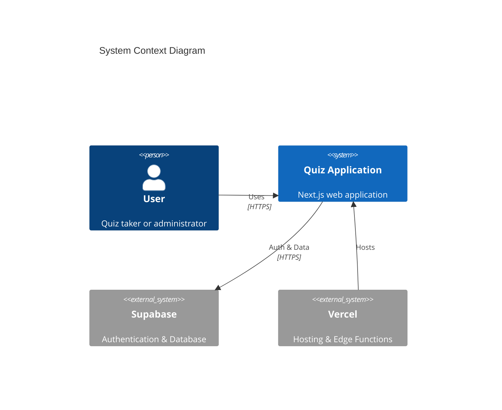
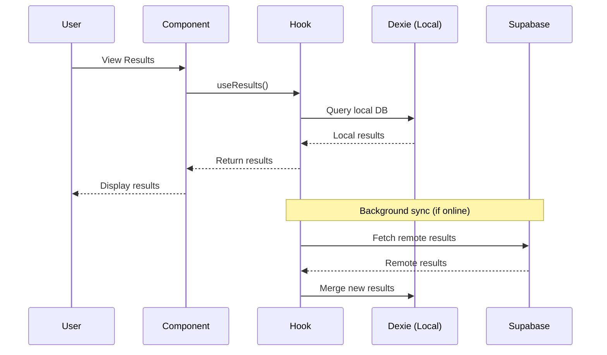
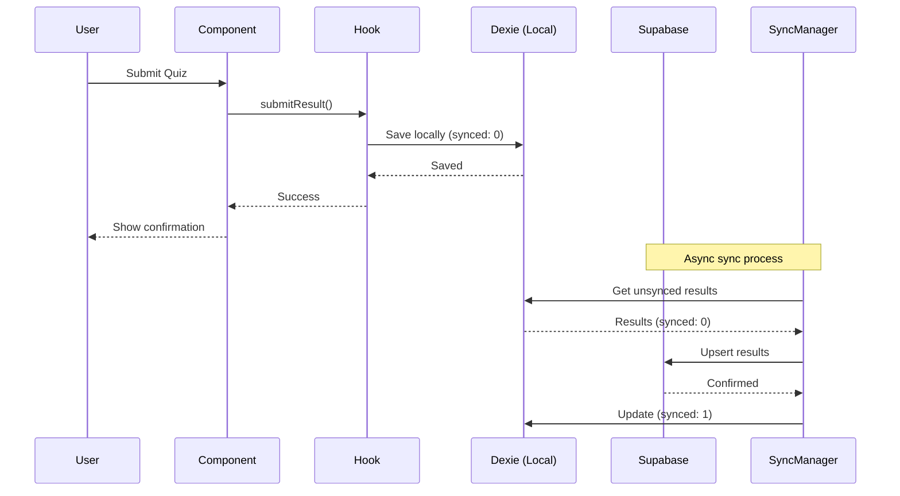
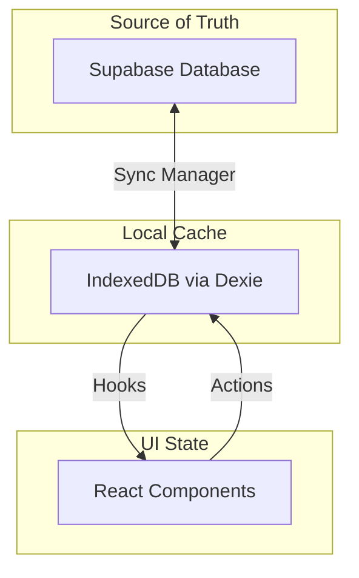
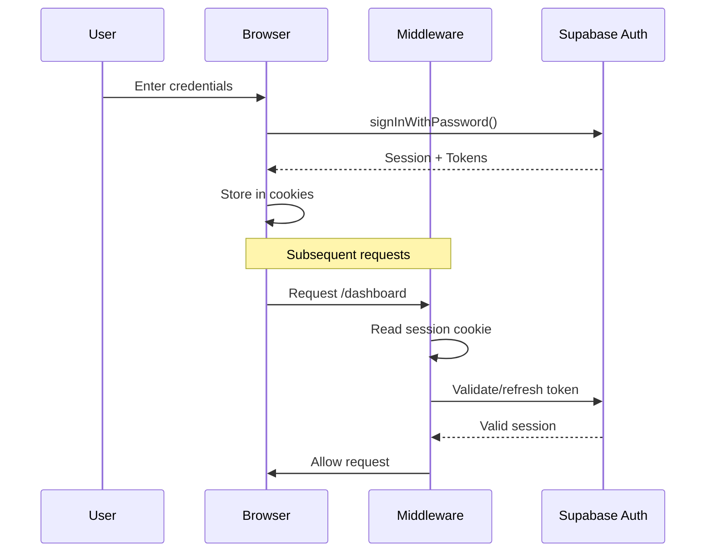

# Architecture Documentation

> This document describes the technical architecture of CertPrep.ai.

## Table of Contents

- [System Overview](#system-overview)
- [Technology Stack](#technology-stack)
- [Application Structure](#application-structure)
- [Data Flow](#data-flow)
- [State Management](#state-management)
- [Authentication Flow](#authentication-flow)
- [Sync Architecture](#sync-architecture)
- [Security Architecture](#security-architecture)
- [Performance Considerations](#performance-considerations)
- [Decision Records](#decision-records)

---

## System Overview



### High-Level Architecture

```text
┌─────────────────────────────────────────────────────────────────────┐
│                            Client Browser                            │
├─────────────────────────────────────────────────────────────────────┤
│  ┌─────────────┐  ┌─────────────┐  ┌─────────────────────────────┐ │
│  │   Next.js   │  │    React    │  │        Tailwind CSS         │ │
│  │  App Router │  │ Components  │  │          Styling            │ │
│  └──────┬──────┘  └──────┬──────┘  └─────────────────────────────┘ │
│         │                │                                          │
│  ┌──────┴────────────────┴──────┐  ┌─────────────────────────────┐ │
│  │        Custom Hooks           │  │      IndexedDB (Dexie)      │ │
│  │  useAuth, useSync, useQuiz   │  │   Local Storage & Cache     │ │
│  └──────────────┬───────────────┘  └──────────────┬──────────────┘ │
│                 │                                  │                │
│  ┌──────────────┴──────────────────────────────────┴──────────────┐ │
│  │                       Sync Manager                              │ │
│  │              Bi-directional data synchronization                │ │
│  └──────────────────────────────┬─────────────────────────────────┘ │
└─────────────────────────────────┼───────────────────────────────────┘
                                  │ HTTPS
┌─────────────────────────────────┼───────────────────────────────────┐
│                            Supabase                                  │
├─────────────────────────────────┼───────────────────────────────────┤
│  ┌──────────────┐  ┌────────────┴───────────┐  ┌─────────────────┐ │
│  │     Auth     │  │       PostgreSQL        │  │    Realtime     │ │
│  │   Service    │  │   + Row Level Security  │  │  (Future Use)   │ │
│  └──────────────┘  └────────────────────────┘  └─────────────────┘ │
└─────────────────────────────────────────────────────────────────────┘
```

---

## Technology Stack

### Frontend

| Technology                                    | Purpose           | Version           |
| --------------------------------------------- | ----------------- | ----------------- |
| [Next.js](https://nextjs.org/)                | React Framework   | App Router (v16+) |
| [React](https://react.dev/)                   | UI Library        | 19.x              |
| [TypeScript](https://www.typescriptlang.org/) | Type Safety       | 5.x               |
| [Tailwind CSS](https://tailwindcss.com/)      | Styling           | 3.x               |
| [Dexie.js](https://dexie.org/)                | IndexedDB Wrapper | 3.x               |

### Backend

| Technology                                                                     | Purpose             |
| ------------------------------------------------------------------------------ | ------------------- |
| [Supabase Auth](https://supabase.com/auth)                                     | Authentication      |
| [Supabase Database](https://supabase.com/database)                             | PostgreSQL Database |
| [Row Level Security](https://supabase.com/docs/guides/auth/row-level-security) | Data Access Control |

### Supabase Database Schema

To run this project against your own Supabase instance, you should provision at least the following tables.

> These schemas are intentionally minimal and mirror what the code expects. You can extend them to fit your own needs.

#### `results`

Stores per‑attempt quiz results and is synchronized between Dexie and Supabase.

```sql
create table if not exists public.results (
  id uuid primary key,
  user_id uuid not null,
  quiz_id text not null,
  timestamp bigint not null,
  mode text not null check (mode in ('zen','proctor')),
  score integer not null,
  time_taken_seconds integer not null,
  answers jsonb not null,
  flagged_questions text[] not null default '{}',
  category_breakdown jsonb not null,
  created_at timestamptz not null default now()
);

alter table public.results enable row level security;
```

Recommended indexes:

```sql
create index if not exists results_user_id_created_at_idx
  on public.results (user_id, created_at desc);

create index if not exists results_user_id_quiz_id_ts_idx
  on public.results (user_id, quiz_id, timestamp desc);
```

RLS policies (owner‑only access):

```sql
create policy "results_select_owner" on public.results
  for select using (auth.uid() = user_id);

create policy "results_insert_owner" on public.results
  for insert with check (auth.uid() = user_id);

create policy "results_update_owner" on public.results
  for update using (auth.uid() = user_id)
  with check (auth.uid() = user_id);

create policy "results_delete_owner" on public.results
  for delete using (auth.uid() = user_id);
```

#### `quizzes`

Stores quiz definitions per user and is synchronized with the local Dexie `quizzes` store.

```sql
create table if not exists public.quizzes (
  id uuid primary key,
  user_id uuid not null,
  title text not null,
  description text,
  tags text[] not null default '{}',
  version integer not null default 1,
  questions jsonb not null,
  quiz_hash text,
  created_at timestamptz not null default now(),
  updated_at timestamptz not null default now(),
  deleted_at timestamptz
);

alter table public.quizzes enable row level security;
```

Recommended indexes:

```sql
create index if not exists quizzes_user_id_updated_at_idx
  on public.quizzes (user_id, updated_at desc);

create index if not exists quizzes_user_id_deleted_at_idx
  on public.quizzes (user_id, deleted_at);

create index if not exists quizzes_user_id_hash_idx
  on public.quizzes (user_id, quiz_hash);
```

RLS policies (owner‑only access):

```sql
create policy "quizzes_select_owner" on public.quizzes
  for select using (auth.uid() = user_id);

create policy "quizzes_insert_owner" on public.quizzes
  for insert with check (auth.uid() = user_id);

create policy "quizzes_update_owner" on public.quizzes
  for update using (auth.uid() = user_id)
  with check (auth.uid() = user_id);
```

> Note: direct `delete` operations are typically not used; the app performs soft‑deletes by setting `deleted_at`.

#### `srs`

Stores Spaced Repetition System (SRS) state for each question/user pair. Synchronized with server-side LWW conflict resolution.

```sql
create table if not exists public.srs (
  question_id text not null,
  user_id uuid not null,
  box integer not null default 1,
  last_reviewed bigint not null,
  next_review bigint not null,
  consecutive_correct integer not null default 0,
  updated_at bigint not null,
  primary key (question_id, user_id)
);

alter table public.srs enable row level security;
```

RLS policies (owner‑only access):

```sql
create policy "srs_select_owner" on public.srs
  for select using (auth.uid() = user_id);

create policy "srs_insert_owner" on public.srs
  for insert with check (auth.uid() = user_id);

create policy "srs_update_owner" on public.srs
  for update using (auth.uid() = user_id)
  with check (auth.uid() = user_id);
```

Server-side LWW upsert RPC for batch sync:

```sql
create or replace function upsert_srs_lww_batch(states jsonb)
returns void as $$
declare
  s jsonb;
begin
  for s in select * from jsonb_array_elements(states)
  loop
    insert into srs (question_id, user_id, box, last_reviewed, next_review, consecutive_correct, updated_at)
    values (
      s->>'question_id',
      (s->>'user_id')::uuid,
      (s->>'box')::int,
      (s->>'last_reviewed')::bigint,
      (s->>'next_review')::bigint,
      (s->>'consecutive_correct')::int,
      (s->>'updated_at')::bigint
    )
    on conflict (question_id, user_id) do update
    set box = excluded.box,
        last_reviewed = excluded.last_reviewed,
        next_review = excluded.next_review,
        consecutive_correct = excluded.consecutive_correct,
        updated_at = excluded.updated_at
    where srs.updated_at < excluded.updated_at;
  end loop;
end;
$$ language plpgsql security definer;
```

#### Intentional Schema Design Decisions

##### No Foreign Key on `results.quiz_id`

`results.quiz_id` intentionally lacks a foreign key constraint to `quizzes.id` because:

1. **Soft-delete pattern**: Quizzes use `deleted_at` for soft-deletes. A traditional FK with `ON DELETE CASCADE` or `ON DELETE RESTRICT` would conflict with this pattern.
2. **Offline-first sync**: In an offline-first architecture, a result may be created and synced before its associated quiz arrives on that device. A strict FK would cause insertion failures during sync.
3. **Graceful degradation**: The UI handles orphaned results (where the quiz no longer exists) gracefully by showing "Unknown Quiz" rather than failing.

##### NIL_UUID Pattern (`00000000-0000-0000-0000-000000000000`)

The `NIL_UUID` constant is used locally in IndexedDB (Dexie) to represent **legacy or orphaned data** that predates per-user scoping:

- **Database migrations** (v5-v7) backfill older records without `user_id` to `NIL_UUID` to prevent cross-account data leakage.
- **Local access checks** allow users to read/modify quizzes with `user_id === NIL_UUID` for backward compatibility.
- **Sync filtering** skips uploading `NIL_UUID` records to Supabase since they cannot be attributed to a real user.

> **Important**: The RLS policies on Supabase only permit access to rows where `auth.uid() = user_id`. This means:
>
> - NIL_UUID rows in Supabase (if any exist) are **inaccessible** via the API.
> - The `.in("user_id", [userId, NIL_UUID])` filter in `quizRemote.ts` is effectively a no-op for remote fetches—Supabase will never return NIL_UUID rows.
> - This dead path remains for potential future global/template quiz features, but is currently non-functional.

### Infrastructure

| Service                                 | Purpose              |
| --------------------------------------- | -------------------- |
| [Vercel](https://vercel.com/)           | Hosting & Deployment |
| [Supabase Cloud](https://supabase.com/) | Backend Services     |

---

## Application Structure

```text
src/
├── app/                          # Next.js App Router
│   ├── analytics/                # Analytics dashboard
│   ├── auth/                     # Auth callback routes
│   ├── login/, signup/           # Auth pages
│   ├── library/                  # Quiz library
│   ├── quiz/                     # Quiz flows ([id]/zen, [id]/proctor)
│   ├── results/                  # Results pages
│   ├── settings/                 # Settings pages
│   ├── layout.tsx                # Root layout
│   └── page.tsx                  # Landing page
│
├── components/
│   ├── auth/                     # Authentication components
│   ├── quiz/                     # Quiz components
│   ├── results/                  # Results components
│   ├── dashboard/                # Dashboard components
│   ├── analytics/                # Analytics components
│   ├── settings/                 # Settings components
│   └── ui/                       # Shared UI components
│
├── db/                           # Local database (Dexie)
│   ├── index.ts                  # Database initialization
│   ├── quizzes.ts                # Quiz operations
│   └── results.ts                # Results operations
│
├── hooks/                        # Custom React hooks
│
├── lib/                          # Utility libraries
│   ├── supabase/
│   │   ├── client.ts             # Browser Supabase client
│   │   └── server.ts             # Server Supabase client
│   ├── sync/
│   │   ├── syncManager.ts        # Result sync orchestration
│   │   └── quizSyncManager.ts    # Quiz sync orchestration
│   └── sanitize.ts               # HTML sanitization
│
├── types/                        # TypeScript definitions
│   ├── quiz.ts
│   ├── result.ts
│   └── user.ts
│
└── proxy.ts                      # CSP proxy helper for Supabase
```

---

## Data Flow

### Read Operation Flow



### Write Operation Flow



---

## State Management

### State Locations

| State Type   | Location        | Example            |
| ------------ | --------------- | ------------------ |
| Server State | Supabase        | User data, results |
| Cache State  | IndexedDB       | Offline data copy  |
| UI State     | React useState  | Modal open/close   |
| Form State   | React Hook Form | Form inputs        |
| Auth State   | Supabase Auth   | User session       |

### State Flow Diagram



---

## Authentication Flow



### Session Management

| Aspect       | Implementation                |
| ------------ | ----------------------------- |
| Storage      | HTTP-only cookies             |
| Refresh      | Automatic via middleware      |
| Expiry       | Configurable (default 1 hour) |
| Invalidation | Logout clears cookies         |

---

## Sync Architecture

### Sync Strategy

```text
┌─────────────────────────────────────────────────────────────────┐
│                        Sync Manager                              │
├─────────────────────────────────────────────────────────────────┤
│                                                                  │
│  1. PUSH Phase                                                   │
│     ┌─────────┐      ┌─────────┐      ┌─────────┐              │
│     │ Local   │ ───► │ Filter  │ ───► │ Upsert  │              │
│     │ Results │      │synced=0 │      │ Remote  │              │
│     └─────────┘      └─────────┘      └─────────┘              │
│                                              │                   │
│                                              ▼                   │
│                                        Mark synced=1             │
│                                                                  │
│  2. PULL Phase                                                   │
│     ┌─────────┐      ┌─────────┐      ┌─────────┐              │
│     │ Remote  │ ───► │ Filter  │ ───► │  Add    │              │
│     │ Results │      │ New IDs │      │ Local   │              │
│     └─────────┘      └─────────┘      └─────────┘              │
│                                                                  │
└─────────────────────────────────────────────────────────────────┘
```

### Conflict Resolution

| Scenario                | Strategy                           |
| ----------------------- | ---------------------------------- |
| Same ID, different data | Last-write-wins (server timestamp) |
| Local only              | Push to server                     |
| Remote only             | Pull to local                      |
| Both exist, same data   | No action                          |

---

## Security Architecture

### Defense Layers

```text
┌─────────────────────────────────────────────────────────────────┐
│                     Layer 1: Transport                           │
│                     TLS 1.3 Encryption                           │
├─────────────────────────────────────────────────────────────────┤
│                     Layer 2: Authentication                      │
│                   Supabase Auth + JWT Tokens                     │
├─────────────────────────────────────────────────────────────────┤
│                     Layer 3: Authorization                       │
│                PostgreSQL Row Level Security                     │
├─────────────────────────────────────────────────────────────────┤
│                     Layer 4: Input Validation                    │
│              Client & Server-side Validation                     │
├─────────────────────────────────────────────────────────────────┤
│                     Layer 5: Output Encoding                     │
│            React Escaping + sanitizeHTML()                       │
└─────────────────────────────────────────────────────────────────┘
```

### RLS Policies

```sql
-- Example RLS policies
CREATE POLICY "Users can view own results" ON results
    FOR SELECT USING (auth.uid() = user_id);

CREATE POLICY "Users can insert own results" ON results
    FOR INSERT WITH CHECK (auth.uid() = user_id);

CREATE POLICY "Users can update own results" ON results
    FOR UPDATE USING (auth.uid() = user_id)
    WITH CHECK (auth.uid() = user_id);
```

---

## Performance Considerations

### Optimization Strategies

| Area            | Strategy                                  |
| --------------- | ----------------------------------------- |
| Initial Load    | Code splitting, lazy loading              |
| Data Fetching   | Custom hooks with Supabase client + Dexie |
| Offline Support | IndexedDB caching                         |
| Images          | Next.js Image optimization                |
| Styles          | Tailwind CSS purging                      |

### Performance Metrics Targets

| Metric | Target | Current |
| ------ | ------ | ------- |
| FCP    | < 1.5s | TBD     |
| LCP    | < 2.5s | TBD     |
| TTI    | < 3.5s | TBD     |
| CLS    | < 0.1  | TBD     |

---

## Decision Records

### ADR-001: Next.js App Router

**Status:** Accepted

**Context:** Need modern React framework with SSR support.

**Decision:** Use Next.js 16 with App Router.

**Consequences:**

- ✅ Built-in SSR/SSG
- ✅ File-based routing
- ✅ Server Components support
- ⚠️ Learning curve for App Router

---

### ADR-002: Supabase for Backend

**Status:** Accepted

**Context:** Need authentication and database with minimal setup.

**Decision:** Use Supabase for auth and PostgreSQL database.

**Consequences:**

- ✅ Quick setup
- ✅ Built-in auth
- ✅ Row Level Security
- ⚠️ Vendor dependency

---

### ADR-003: IndexedDB for Offline

**Status:** Accepted

**Context:** Need offline capability for quiz taking.

**Decision:** Use Dexie.js as IndexedDB wrapper.

**Consequences:**

- ✅ Offline support
- ✅ Fast local queries
- ⚠️ Sync complexity
- ⚠️ No encryption at rest

---

## Further Reading

- [Next.js Documentation](https://nextjs.org/docs)
- [Supabase Documentation](https://supabase.com/docs)
- [Dexie.js Documentation](https://dexie.org/docs/)
